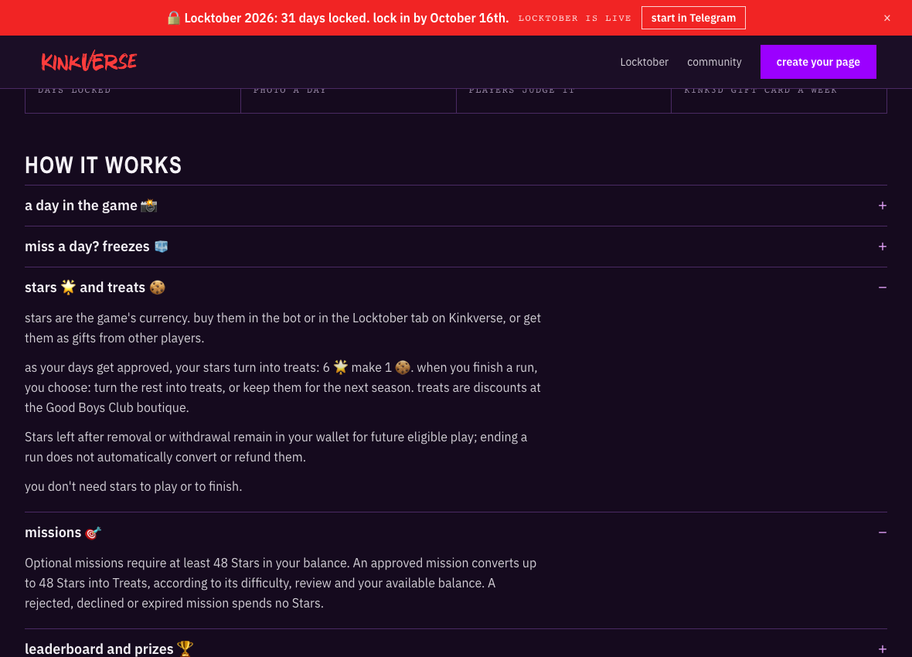
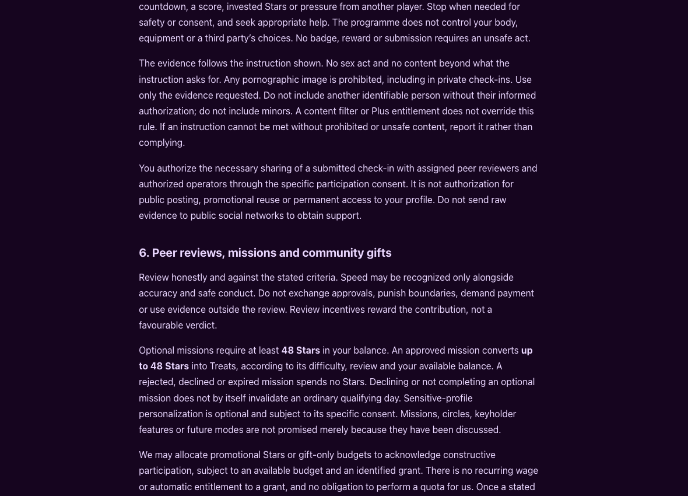
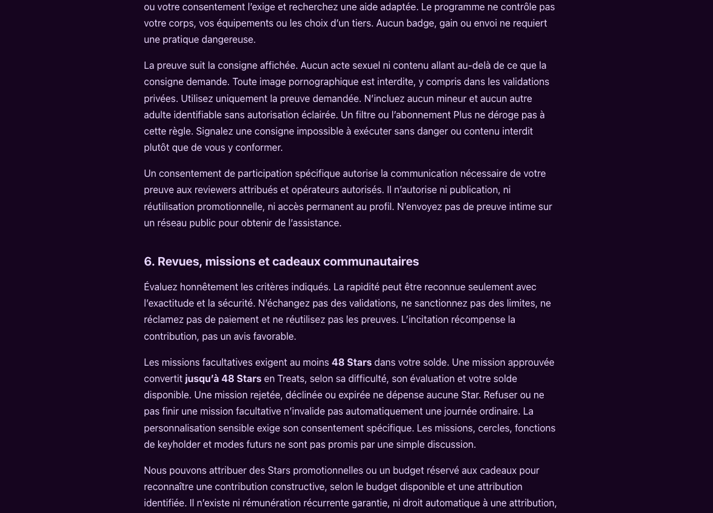

# Locktober follow-up browser evidence

Captured 8 October 2026 (Europe/Paris), from the actual built local website using desktop Chromium at 1180 × 850. External analytics and third-party requests were blocked. The landing-page mission and balance folds were opened through their real controls; both generated English and French legal pages were checked for the approved 48-Star wording and retained-wallet statement. No member fixtures, accounts or production systems were used.

The lead inspected all pixels and PNG chunks before publication: only IHDR, IDAT and IEND; no embedded text, EXIF, credentials, contacts, browser chrome or local paths. Screenshots show public wording; functional acceptance comes from browser assertions, not the still images.

Tested component SHA-256: `65a63696c9d108e8c775894ce1e7693ee2da4764e0a438fa5f1f57171fadb102`. The PR records the final tested commit; these images correspond to this component and the legal documents shipped in that revision.

