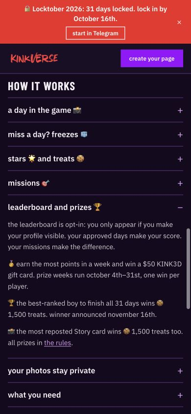
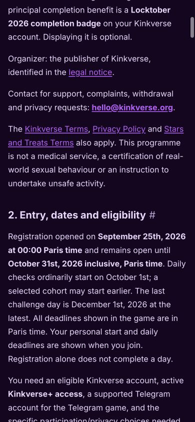
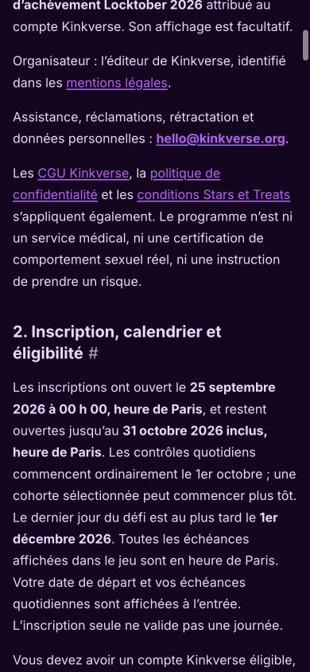
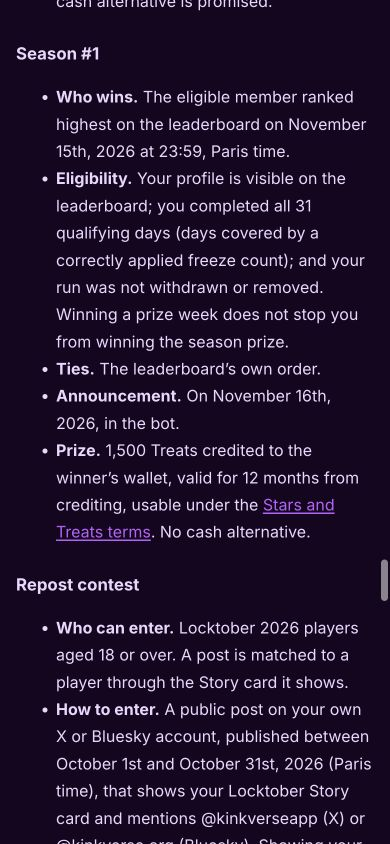
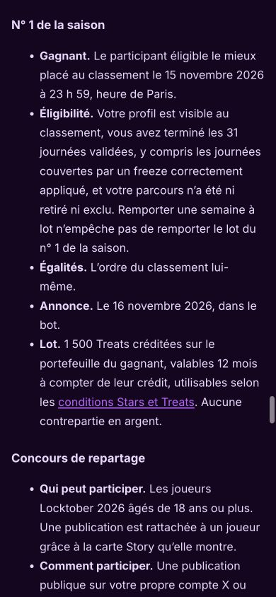

# Final authored prize and calendar evidence

Captured October 3rd, 2026 (Europe/Paris), from the production build of source `f0db98548c294bce795d1b6f5b5f7997de288374`, served on the supervisor’s isolated local preview. No signed-in account or member data appears: these are public landing/rules pages. Each capture is a typical iPhone viewport, 390×844.

The supervisor personally inspected all five captures and their embedded metadata before copying them here; stored bytes match those inspected exactly. They contain public authored copy and the public support address only, no private contacts, credentials, browser address bars or local paths. JPEG metadata is JFIF only, without EXIF, XMP or comments. Independent Astra visual review accepted readable layout, full bilingual season rules and the landing prize block.

## Landing prize discovery

The real landing-page accordion was opened through its normal control. It preserves visible opt-in and the three authored prize paragraphs: weekly KINK3D gift card October 4th–31st, once per player; all-31-day season prize, November 16th announcement; repost contest and link to rules. The existing October 16th banner is the early-bird subscription-price deadline, independently explained in the landing page, rather than the registration cutoff.

## Registration and challenge dates

## Full season prize rules

## Verification and limitations

`npm run build` passed on the captured source: TypeScript, production Vite build and 14 legal pages plus index. Hosted source build passed. The supervisor followed the landing rules link and section anchors, checked the rendered bilingual dates and full season text, and preserved historical version notes. These still images show actual copy/layout; they do not prove game eligibility, provide legal validation, publish rules or authorize production action.

The local Vite SPA preview falls back to the landing page for extensionless legal links without a trailing slash; these captures use the generated directory routes. Read-only investigation verified the configured GitHub Pages production route redirects to the correct slash document. No hosting change was required. The October 2nd captures are explicitly older illustrative evidence in their own README, with unrecorded runtime-source SHA; they do not establish the final wording.
